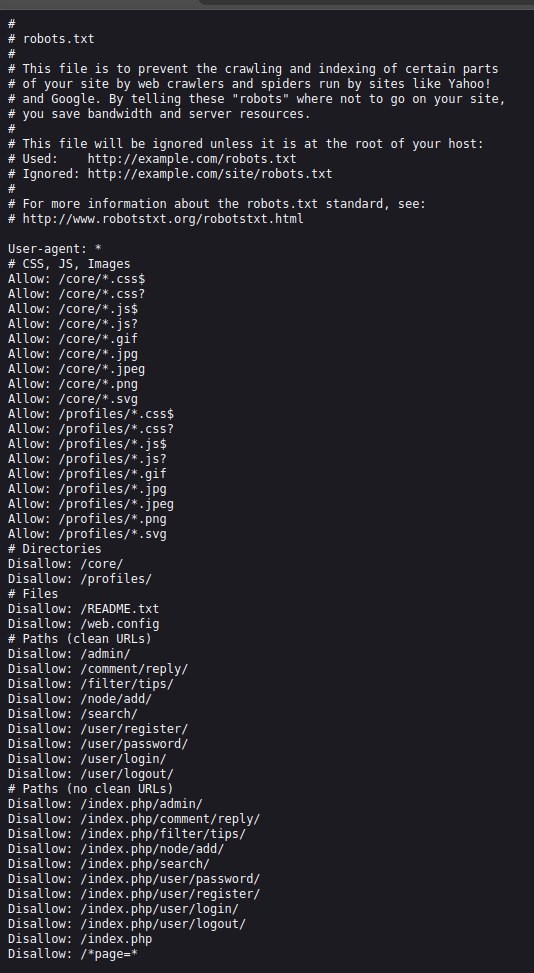
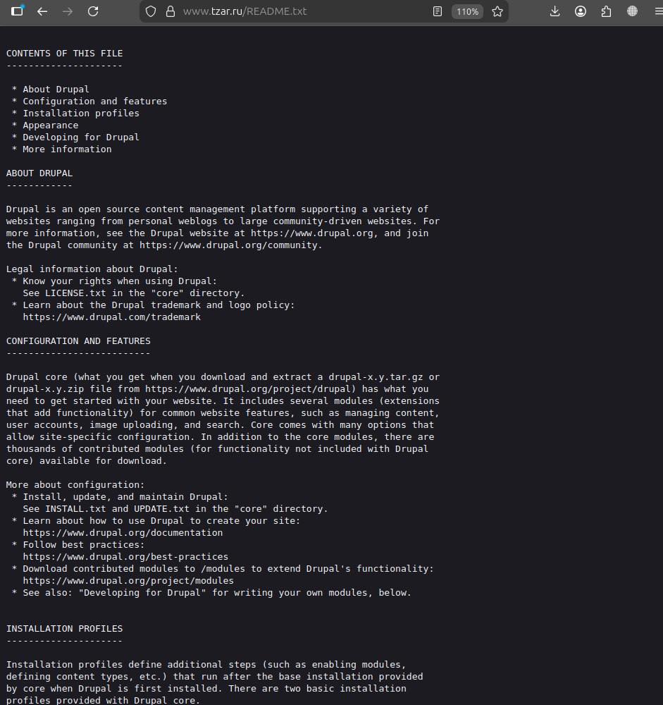
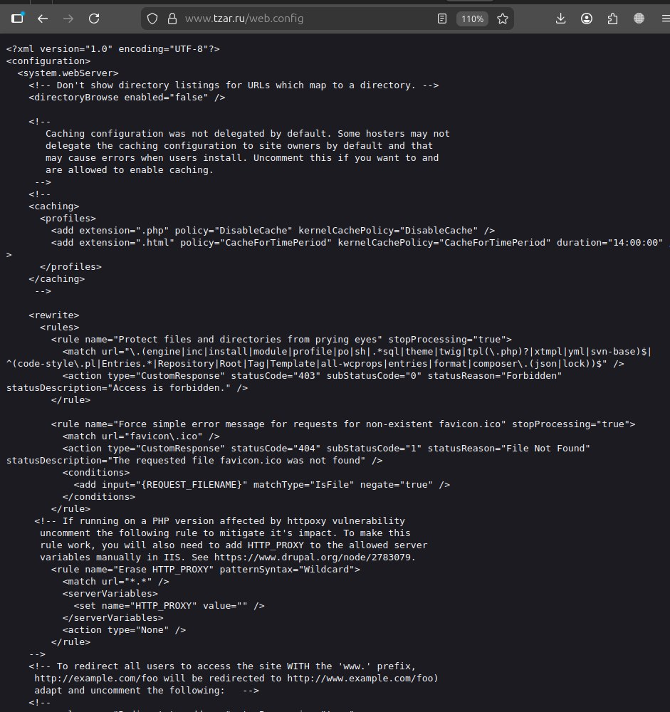
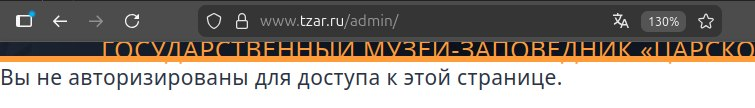
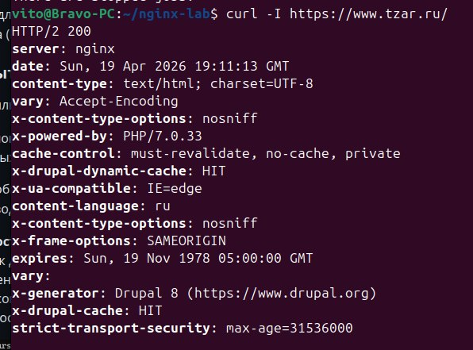

# Лабораторная работа №3  
## Настройка nginx

# Часть 1

## Цель работы

Настроить веб-сервер nginx для обслуживания нескольких сайтов на одном сервере с использованием HTTPS.

## Ход работы

В ходе выполнения лабораторной работы были выполнены следующие действия:

- установлен и запущен nginx  
- сгенерирован самоподписанный SSL-сертификат  
- настроен HTTPS (порт 443)  
- реализован редирект HTTP → HTTPS (порт 80)  
- настроены виртуальные хосты:
  - `pet1.local`
  - `pet2.local`  
- реализован механизм `alias`  
- исправлена кодировка (UTF-8)  

## Результаты работы

### Первый сайт (pet1)

### Второй сайт (pet2)

### Проверка alias

### При переходе по HTTP происходит автоматическое перенаправление на HTTPS.

## Итоги первой части

В ходе первой части лабораторной работы был настроен веб-сервер nginx для обслуживания нескольких сайтов. Реализована работа через HTTPS, настроены виртуальные хосты и механизм alias.  

# Часть 2

## 1. Поиск скрытых файлов и директорий

**Метод:** анализ robots.txt и ручная проверка URL

Были найдены потенциально чувствительные пути:
- /web.config
- /README.txt
- /admin/
- /user/login/

Проверка показала, что `web.config` и `README.txt` доступны

**Вывод:**  
Обнаружена уязвимость типа *Information Disclosure* — сервер раскрывает конфигурационные и служебные файлы.

**Скриншоты:**

## 2. Проверка Path Traversal

**Метод:** попытка доступа к системным файлам

Проверен URL: https://www.tzar.ru/etc/passwd
В результате доступ не был получен (страница не найдена)

**Вывод:**  
Уязвимость Path Traversal не подтверждена.

**Скриншот:**

## 3. Проверка административных URL

**Метод:** проверка доступности служебных разделов

Проверены:
- /admin/
- /user/login/

**Результат:**  
Доступ ограничен (требуется авторизация)

**Вывод:**  
Контроль доступа настроен корректно.

**Скриншот:**

---

## Общий вывод

В ходе анализа были применены три метода проверки.

Обнаружены уязвимости, связанные с раскрытием информации (web.config, README.txt),  
однако критических проблем (обход доступа, traversal) не выявлено.
