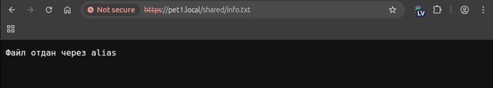
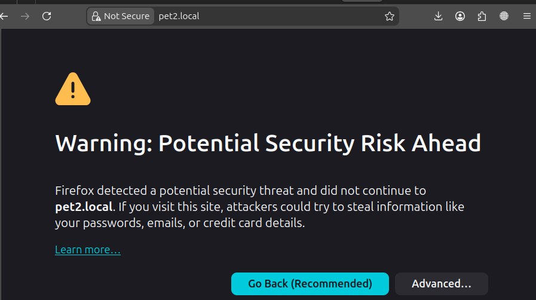

# Лабораторная работа №3  
## Настройка nginx

## Цель работы

Настроить веб-сервер nginx для обслуживания нескольких сайтов на одном сервере с использованием HTTPS.

## Ход работы

В ходе выполнения лабораторной работы были выполнены следующие действия:

- установлен и запущен nginx  
- сгенерирован самоподписанный SSL-сертификат  
- настроен HTTPS (порт 443)  
- реализован редирект HTTP → HTTPS (порт 80)  
- настроены виртуальные хосты:
  - `pet1.local`
  - `pet2.local`  
- реализован механизм `alias`  
- исправлена кодировка (UTF-8)  

## Результаты работы

### Первый сайт (pet1)

### Второй сайт (pet2)

### Проверка alias

### Проверка редиректа HTTP → HTTPS

## Вывод

В ходе первой части лабораторной работы был настроен веб-сервер nginx для обслуживания нескольких сайтов. Реализована работа через HTTPS, настроены виртуальные хосты и механизм alias.  
