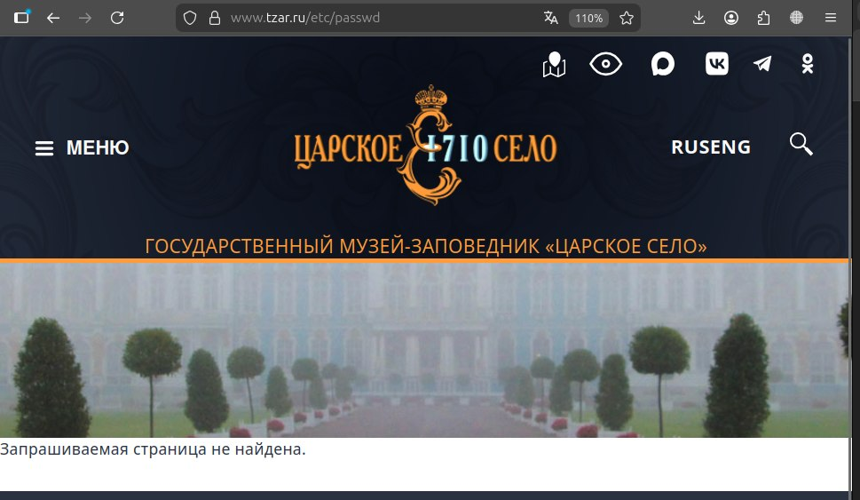

# Лабораторная работа №3  
## Настройка nginx

# Часть 1

## Цель работы

Настроить веб-сервер nginx для обслуживания нескольких сайтов на одном сервере с использованием HTTPS

## Ход работы

В ходе выполнения лабораторной работы были выполнены следующие действия:

- установлен и запущен nginx  
- сгенерирован самоподписанный SSL-сертификат  
- настроен HTTPS (порт 443)  
- реализован редирект HTTP - HTTPS (порт 80)  
- настроены виртуальные хосты:
  - `pet1.local`
  - `pet2.local`  
- реализован механизм `alias`  
- исправлена кодировка (UTF-8)  

## Результаты работы

### Первый сайт (pet1)

### Второй сайт (pet2)

### Проверка alias

### При переходе по HTTP происходит автоматическое перенаправление на HTTPS.

## Итоги первой части

## Итоги первой части

 В процессе работы был развернут и запущен nginx, после чего выполнена настройка двух виртуальных хостов - pet1.local и pet2.local. Для обеспечения защищённого соединения была реализована работа по протоколу HTTPS с использованием SSL-сертификата, а также настроен авто редирект с HTTP (порт 80) на HTTPS (порт 443)
Кроме того, был реализован механизм alias, позволяющий обращаться к файлам из отдельной директории, что было успешно проверено на практике.
В результате оба сайта корректно открываются по защищённому протоколу HTTPS, обслуживаются одним экземпляром nginx и работают независимо друг от друга за счёт использования виртуальных хостов.

# Часть 2

## 1. Поиск скрытых файлов и директорий

**Метод:** анализ robots.txt и ручная проверка URL

Были найдены потенциально чувствительные пути:
- /web.config
- /README.txt
- /admin/
- /user/login/

Проверка показала, что `web.config` и `README.txt` доступны

**Вывод:**  
Обнаружена уязвимость типа *Information Disclosure*, то есть сервер раскрывает конфигурационные и служебные файлы.

**Скриншоты:**

## 2. Проверка Path Traversal

**Метод:** попытка доступа к системным файлам

Проверены URL:
- https://www.tzar.ru/etc/passwd
- https://www.tzar.ru/../../etc/passwd

В результате доступ не был получен (страница не найдена)

**Вывод:**  
Уязвимость Path Traversal не подтверждена.

**Скриншот:**

## 3. Проверка административных URL

**Метод:** проверка доступности служебных разделов

Проверены:
- /admin/
- /user/login/

**Результат:**  
Доступ ограничен (требуется авторизация)

**Вывод:**  
Контроль доступа настроен корректно.

**Скриншот:**

## 4. Анализ HTTP-заголовков

**Метод:** анализ ответа сервера с помощью curl

Выполнена команда: curl -I https://www.tzar.ru/

Благодаря этому определен сервер (nginx), версия PHP (7.0.33) и CMS (Drupal 8)

**Вывод:**  
Сервер раскрывает техническую информацию о используемом ПО.

**Скриншот:**

## Вывод по второй части

В ходе выполнения второй части работы был проведён анализ безопасности веб-сайта с использованием нескольких методов проверки.

Были выявлены уязвимости, связанные с раскрытием служебной информации: доступ к конфигурационному файлу `web.config`, доступ к файлу `README.txt`, а также раскрытие структуры сайта через `robots.txt` и HTTP-заголовки. Это позволяет получить представление о внутреннем устройстве сервера и используемом программном обеспечении, что может быть использовано для дальнейшего анализа и поиска более серьёзных уязвимостей.

При этом критические уязвимости, такие как обход директорий или несанкционированный доступ к административным разделам, обнаружены не были. Это свидетельствует о корректной настройке механизмов защиты доступа.

Таким образом, сайт в целом защищён от прямых атак, по крайней мере - кривыми руками)
