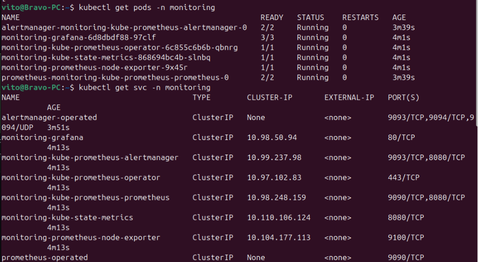
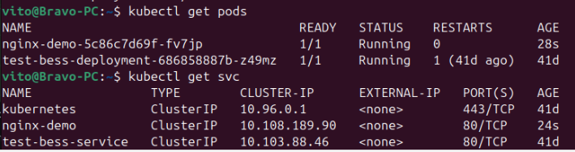
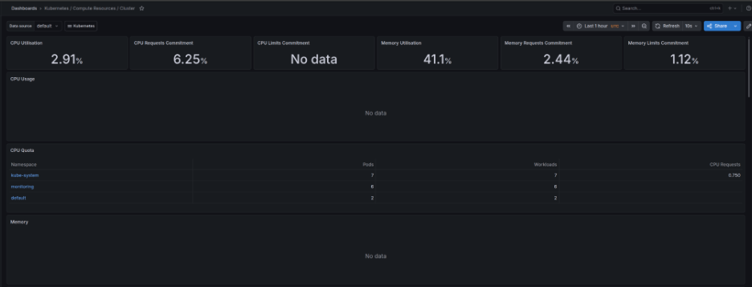
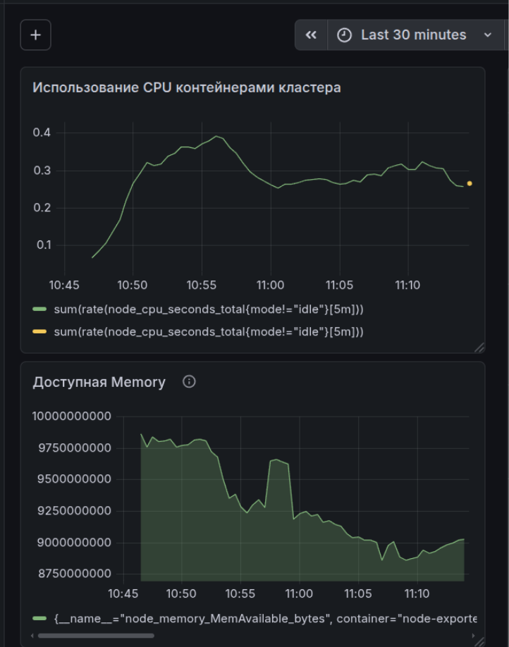

# Лабораторная работа №5: мониторинг сервиса в Kubernetes

## Цель работы

Цель лабораторной работы — настроить мониторинг сервиса, запущенного в Kubernetes, с помощью Prometheus и Grafana.

В качестве тестового сервиса был использован `nginx`, запущенный в локальном Kubernetes-кластере через Minikube.

## Что было сделано

В ходе работы был поднят локальный Kubernetes-кластер с помощью Minikube.  
После этого через Helm был установлен стек `kube-prometheus-stack`, в который входят Prometheus, Grafana, node-exporter, kube-state-metrics, Alertmanager и Prometheus Operator.

Prometheus использовался для сбора метрик Kubernetes-кластера, а Grafana — для их визуализации.  
Также был создан тестовый сервис `nginx-demo`, чтобы проверить работу приложения внутри Kubernetes и отобразить состояние системы на графиках.

## Используемые технологии

- Linux
- Docker
- Minikube
- Kubernetes
- kubectl
- Helm
- Prometheus
- Grafana
- nginx

## Структура проекта

```text
.
├── README.md
├── k8s
│   ├── deployment.yaml
│   ├── service.yaml
│   └── kustomization.yaml
├── monitoring
│   └── grafana-queries.md
└── screenshots
    ├── 01-monitoring-pods-services.png
    ├── 02-nginx-service.png
    ├── 03-grafana-login.png
    ├── 04-default-dashboard.png
    └── 05-custom-dashboard-cpu-memory.png
```

## Запуск Kubernetes-кластера

Сначала был запущен локальный Kubernetes-кластер:

```bash
minikube start --driver=docker
```

Проверка состояния кластера:

```bash
kubectl get nodes
kubectl get pods -A
```

## Установка Prometheus и Grafana

Для установки Prometheus и Grafana использовался Helm chart `kube-prometheus-stack`.

Добавление Helm-репозитория:

```bash
helm repo add prometheus-community https://prometheus-community.github.io/helm-charts
helm repo update
```

Создание namespace для мониторинга:

```bash
kubectl create namespace monitoring
```

Установка стека мониторинга:

```bash
helm install monitoring prometheus-community/kube-prometheus-stack --namespace monitoring
```

Проверка pod'ов мониторинга:

```bash
kubectl get pods -n monitoring
```

Проверка service'ов мониторинга:

```bash
kubectl get svc -n monitoring
```

## Запуск тестового сервиса

В качестве тестового сервиса был запущен `nginx`.

Применение Kubernetes-манифестов:

```bash
kubectl apply -k k8s/
```

Проверка pod'ов:

```bash
kubectl get pods
```

Проверка service'ов:

```bash
kubectl get svc
```

## Открытие Grafana

Пароль администратора Grafana был получен командой:

```bash
kubectl get secret monitoring-grafana -n monitoring -o jsonpath="{.data.admin-password}" | base64 --decode; echo
```

После этого был выполнен port-forward для доступа к Grafana из браузера:

```bash
kubectl port-forward svc/monitoring-grafana -n monitoring 3000:80
```

Grafana открывалась по адресу:

```text
http://localhost:3000
```

Данные для входа:

```text
Login: admin
Password: пароль из команды выше
```

## Графики в Grafana

В Grafana был создан dashboard `Kubernetes Monitoring`.

На dashboard были добавлены два графика, отражающие состояние системы.

### Использование CPU

PromQL-запрос:

```promql
sum(rate(node_cpu_seconds_total{mode!="idle"}[5m]))
```

Этот график показывает текущую загрузку CPU на Kubernetes-узле.

### Доступная оперативная память

PromQL-запрос:

```promql
node_memory_MemAvailable_bytes
```

Этот график показывает количество доступной оперативной памяти на Kubernetes-узле.

## Скриншоты

### Pod'ы и service'ы мониторинга



### Тестовый сервис nginx



### Вход в Grafana


### Стандартный dashboard Kubernetes



### Собственный dashboard с графиками CPU и Memory



## Вывод

В результате лабораторной работы был настроен мониторинг Kubernetes-кластера с помощью Prometheus и Grafana.

В Kubernetes был запущен тестовый сервис `nginx-demo`. Prometheus собирал метрики состояния кластера, а Grafana отображала эти данные в виде графиков.

Были построены два рабочих графика: использование CPU и доступная оперативная память. Эти графики позволяют оценивать текущее состояние системы и наблюдать за нагрузкой на Kubernetes-узел.
